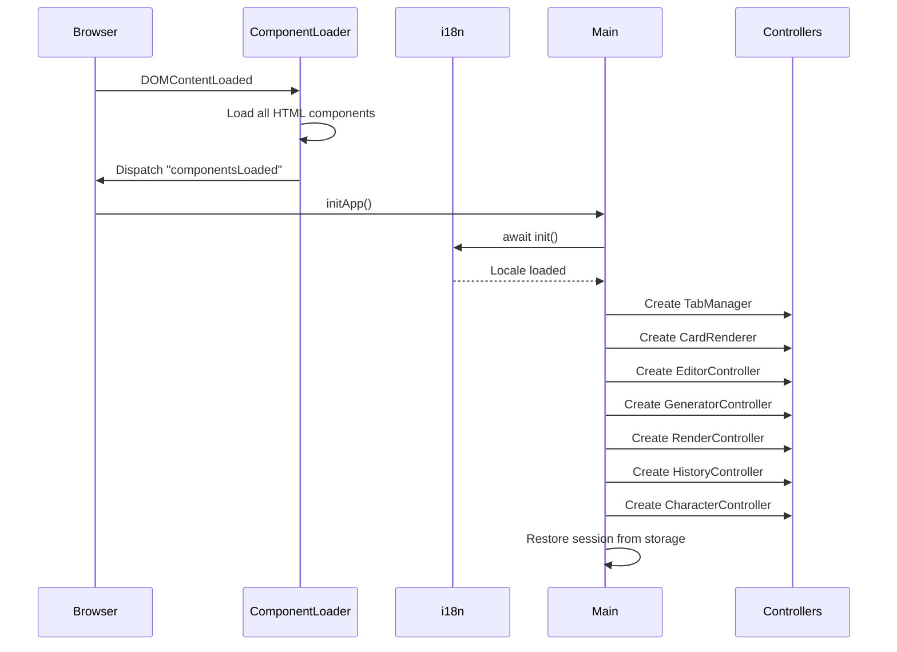

# D&D Card Creator - Architecture

## Directory Structure

```
dnd-card-creator/
├── index.html              # Minimal shell, loads components dynamically
├── vite.config.js          # Vite build configuration
├── package.json            # Dependencies & scripts
│
├── components/             # HTML templates (loaded dynamically)
│   ├── header.html         # Top navigation bar
│   ├── sidebar-start.html  # Right sidebar - item creation form
│   ├── sidebar-end.html    # Left sidebar - edit & design tools
│   ├── preview-panel.html  # Center - canvas & preview
│   ├── character-sheet.html
│   ├── character-sidebar.html
│   ├── equip-modal.html
│   ├── history-gallery.html
│   ├── print-modal.html
│   └── scroll-menu.html
│
├── css/
│   ├── layout.css          # Main layout grid
│   └── components/         # Modular component styles
│       ├── buttons.css
│       ├── character-sheet.css
│       ├── modal.css
│       ├── panels.css
│       ├── scroll-menu.css
│       ├── sidebar.css
│       ├── toast.css
│       └── typography.css
│
├── src/
│   ├── main.js             # App entry point, orchestrates initialization
│   ├── component-loader.js # Dynamic HTML component injection
│   ├── state.js            # Centralized state management
│   ├── i18n.js             # Internationalization service
│   ├── card-renderer.js    # Canvas drawing engine
│   ├── gemini-service.js   # AI API integrations
│   ├── dnd-data.js         # Static D&D data (items, stats)
│   │
│   ├── controllers/        # MVC Controllers
│   │   ├── GeneratorController.js  # Card generation logic
│   │   ├── EditorController.js     # Form → State bindings
│   │   ├── RenderController.js     # State → Canvas
│   │   ├── HistoryController.js    # Gallery management
│   │   ├── CharacterController.js  # Character sheet
│   │   └── TabManager.js           # Tab navigation
│   │
│   ├── services/
│   │   ├── CardViewerService.js    # Card preview modal
│   │   └── GetImgService.js        # GetImg API wrapper
│   │
│   ├── storage/
│   │   └── StorageManager.js       # IndexedDB persistence
│   │
│   ├── ui/
│   │   └── UIManager.js            # UI helpers & toast
│   │
│   ├── utils/
│   │   ├── LayoutCalculator.js     # Card layout algorithm
│   │   ├── SafeAreaDetector.js     # Template safe zone detection
│   │   └── LassoTool.js            # Interactive selection tool
│   │
│   └── locales/
│       ├── he.json         # Hebrew translations
│       └── en.json         # English translations
│
├── public/
│   ├── locales/            # Served translation files
│   └── assets/             # Static images
│
├── cloudflare-worker/      # API proxy for secure key handling
│   ├── worker.js
│   └── README.md
│
└── dist/                   # Production build output
```

## Initialization Flow



## Event System

### Custom Events
| Event | Fired By | Listened By |
|-------|----------|-------------|
| `componentsLoaded` | ComponentLoader | main.js |
| `cardData` | StateManager | RenderController |
| `request-character-equip-item` | RenderController | CharacterController |

### i18n Locale Change
Registered via `i18n.onLocaleChange(callback)`. Used by:
- `main.js` (button text update)
- `CharacterController` (dropdown repopulation)

## External API Dependencies

| Service | Purpose | Config |
|---------|---------|--------|
| Google Gemini | Text generation | API key in localStorage |
| Google Imagen 3 | Image generation | Via Cloudflare Worker |
| GetImg.ai (FLUX) | Image generation | API key in localStorage |
| Cloudflare Worker | API proxy | `dnd-api-proxy.dingalin2000.workers.dev` |
